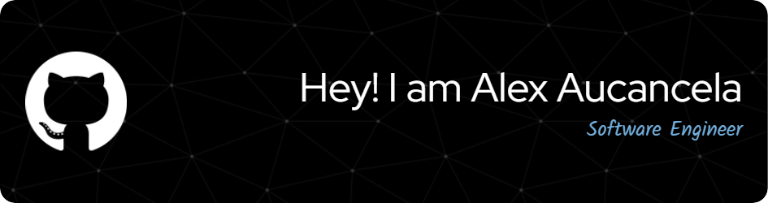

  

	
	

## 👩‍💻 About Me

- 💼 I'm currently working as freelancer Software Engineer
- 🌱 I'm currently learning Angular
- 👀 I’m interested in Software Engineering
- 📫 How to reach me **<alexronaldoaucancelaramos@gmail.com>**

### Lenguages

### Frameworks / technologies

### Databases

### Tools

### Stats

	
	

